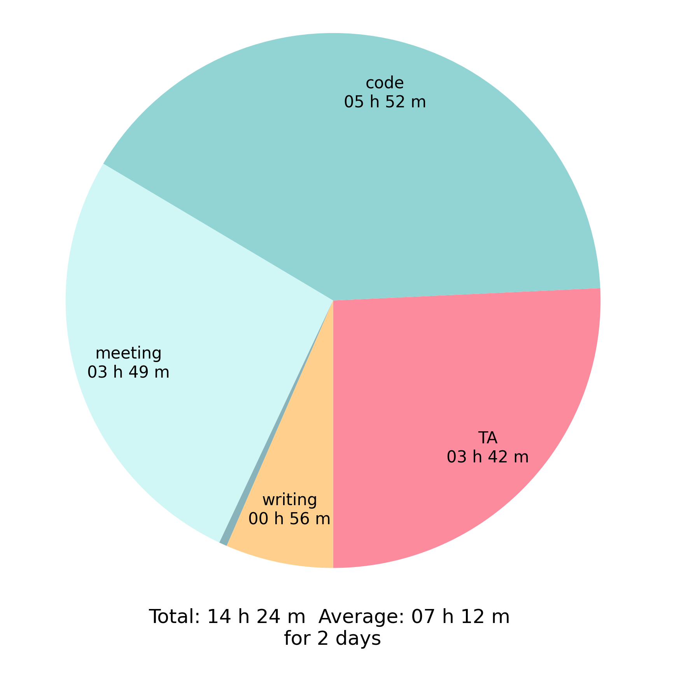
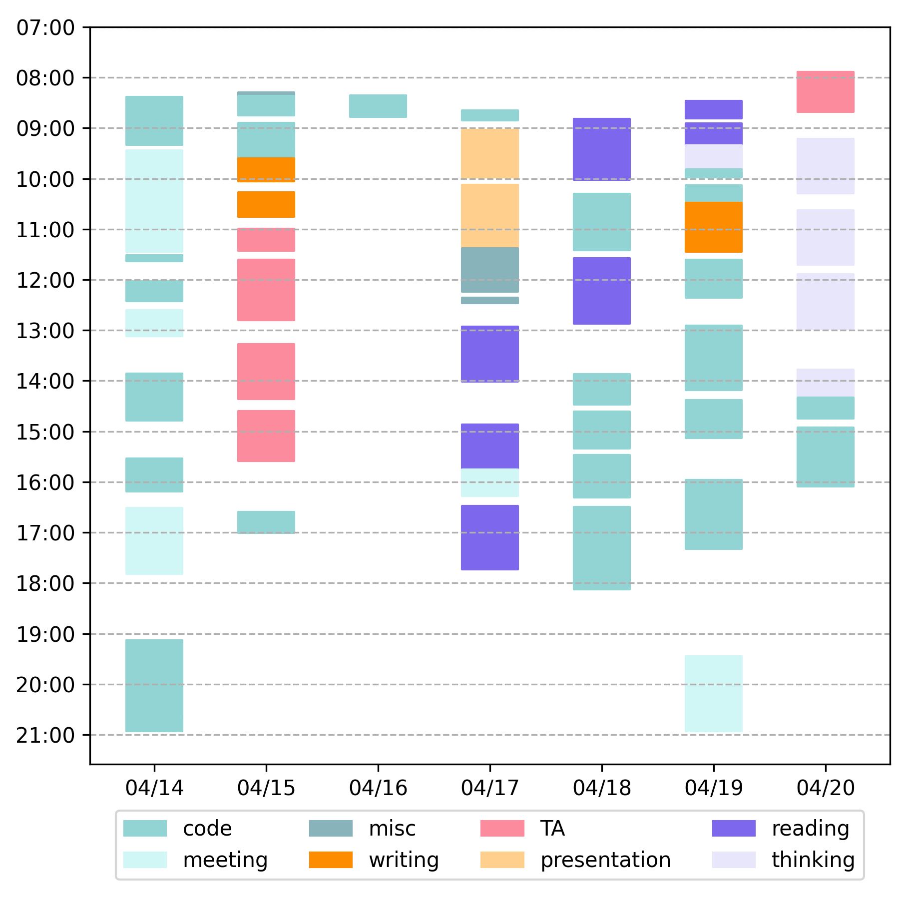
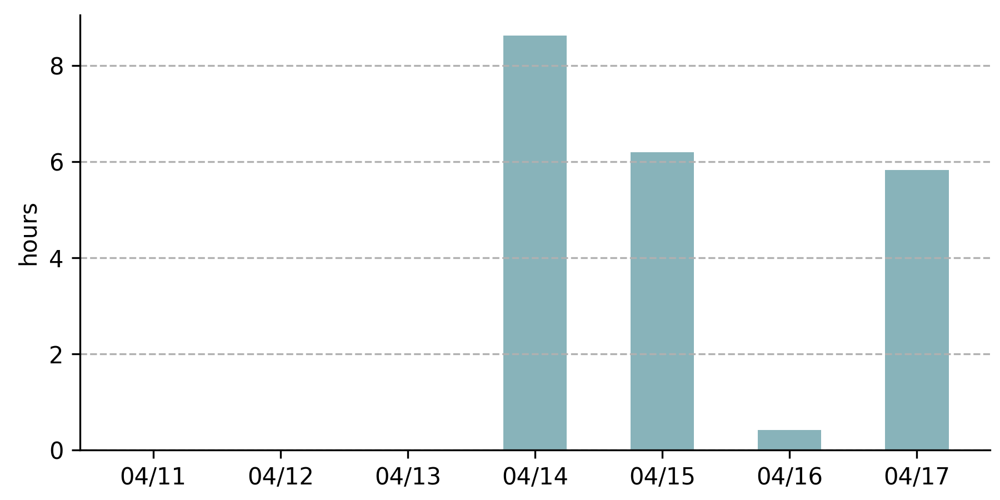

# Time Tracker 
This is a time tracker for my personal use. Previously I used pomotodo to record how long I work every day. But it does not support for exporting data. I want to draw some fancy graphs in a more flexible way. So I am thinking of developing my own one.

Another advantage is that I can manually add a record if I forget to start a record.

This "app" is python based and I want to keep it simple and neat. It is now command line based. I am currently not sure if I want to add a simple GUI...

## Usage

Use the following command to start a recording
```[Python]
python main.py --task meeting
```
where `meeting` is a task name. One can also change the task list in [config.py](config.py).

Some shortcut command can also be found in the [Makefile](Makefile).

## Data Analysis 

Use the following command to do the data analysis:
```[Python]
python plot.py --days 1 [--tabdays] [--bardays] [--cn]
```
All the figures are stored in the [figs/](figs/) folder. I also add a [sample](time_tracker_data/sample.csv) data which contains the real data of the first week since this project. Feel free to delete the sample data for your own use.

It has the following features:
### Print statistics summary
```
Statistics for previous 7 days
[TA        ]:      4 hours 29 minutes
[code      ]:     18 hours 01 minutes
[meeting   ]:      5 hours 50 minutes
[misc      ]:      1 hours 02 minutes
[presentation]:    2 hours 09 minutes
[reading   ]:      6 hours 31 minutes
[thinking  ]:      4 hours 15 minutes
[writing   ]:      1 hours 54 minutes
[Total time]:     44 hours 15 minutes
[Time per day]:    6 hours 19 minutes
```
### Plot pie chart



### Plot timetable



### Plot working time along date/month (timebar)



